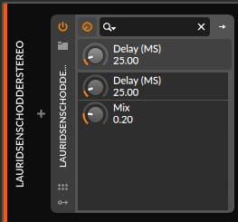

## LauridsenSchodderStereo CLAP plugin
A simple cross-platform (Win, MacOS, Linux)* [CLAP](https://u-he.com/community/clap/) audio plugin which implements the Lauridsen-Schodder 'pseudo stereo' technique. It uses the host's GUI and is mono compatible.  
(Other formats could be built from source, JUCE + CMake based.)

Binaries are found under [Releases](https://github.com/nofishonfriday/Lauridsen-Schodder-Stereo-plugin/releases).  
Current version: v0.9.3 - August 7 2022

Implementation is simple: 
A delayed copy of the left channel is sent to the right channel and v.v., additionally the polarity is flipped on one copy.
When summed to Mono the copies cancel out each other.

Use at your own risk!

*sorry, no ARM builds (yet), the MacOS version is currently not signed and not notarized
